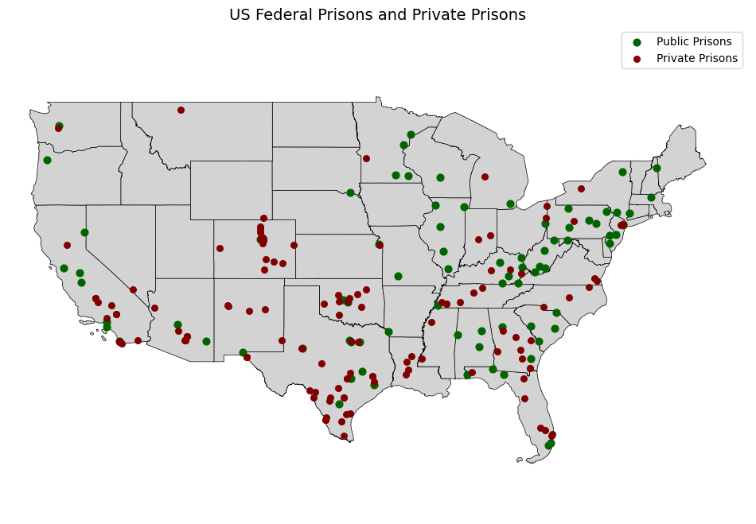
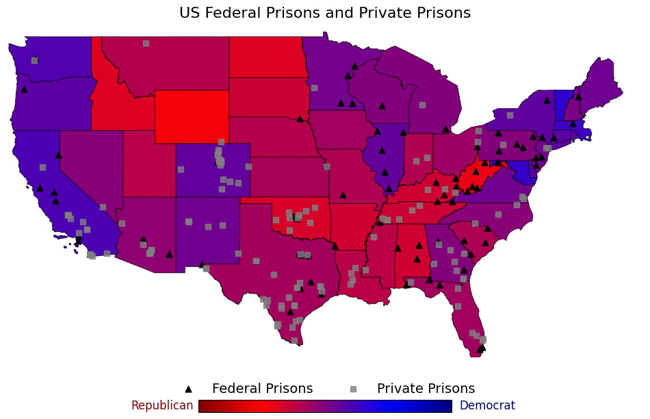

# Mapping Prisons in the US with Scraped Data

## Project Overview
This project scrapes prison names and addresses from publicly available federal and private prison websites using BeautifulSoup, and maps their locations across the US using Geopandas, Google Maps API, and US Census shapefiles. Additionally, data on vote shares for the 2024 presidential candidates were extracted. A second plot was made with each states' vote share along with the locations of the prisons. This project provides a valuable resource for researchers who are interested in studying incarceration geography and for journalists and policy advocates as a visualization of the prison system.

## Features
- Scrapes data from multiple sources (private prison management and federal websites)
- Cleans and structures address data
- Utilizes Google Maps API to transform addresses into latitude and longitude
- Presents the prison locations in a map

## Tech Stack
The following libraries and tools were used:
- BeautifulSoup
- Pandas
- Geopandas
- Shapely
- Matplotlib
- Google Maps API

## Visualization

## Data Sources
- [Core Civic (private prison management)](https://www.corecivic.com/facilities)
- [Geo (private prison management)](https://www.geogroup.com/LOCATIONS)
- [Bureau of Prisons](https://www.bop.gov/locations/list.jsp)
- [UCSB Presidential Vote Share](https://www.presidency.ucsb.edu/statistics/elections/2024)

